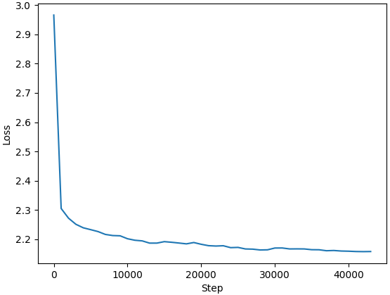

# cdpo
Cory's Direct Preference Optimization replication work

The goal is to replicate the dialogue task results (i.e. Figure 3) from the [original DPO paper](https://arxiv.org/abs/2305.18290).

## Using the Repository

Source code can be found in [`src`](./src).

[`scripts/eval_win_rate.py`](./scripts/eval_win_rate.py) can be used to evaluate responses using the ChatGPT AI.

[`scripts/train_and_eval.py`](./scripts/train_and_eval.py) can be used to run the full pipeline of supervised fine tuning (SFT) followed by DPO.

### Installation

Use an editable install to work with the code locally:

`python -m pip install -e .`

## Results

The basic strategy was to train on smaller models with a local GPU while the code was being developed, and then move to larger cloud GPUs to train the larger models.

In an effort to be time, GPU memory, and cash efficient, data set and response sizes were reduced. Otherwise, training processes followed the paper as much as possible

### GPT2-small

### Methods

- Responses longer than 1280 characters were discarded.
- A validation set of 1000 examples was used to prevent overfitting.
- The learning rate was increased due to a smaller model.
- 250 generated responses from the test set were evaluated against the chosen response using GPT-4o-mini to compute the win rate
- The generations were done at a temperature of 0.7, and gpt-4o-mini was run at a temperature of 0.

| Stage | Optimizer |  LR  | Steps | n_batch | Train Set Size |
|-------|-----------|------|-------|---------|----------------|
| SFT   | AdamW     | 5e-5 | 43K   | 8       | 116K           |
| DPO   | RMSProp   | 1e-5 | 2400  | 64      | 115K           |

### Results

| Model                | Win Rate   |
|----------------------|----------- |
| GPT2-small           |  9.2%      |
| GPT2-sm fine tuned   |  29.6%     |
| GPT2-sm DPO          |  41.2%     |

Here is the loss on the validation set for fine tuning:

Here are the loss, chosen vs reject win rate and avg log probability improvement for DPO:

### GPT2-medium

### Methods

- Same as above, with a slightly lower learning rate since model is bigger

| Stage | Optimizer |  LR  | Steps | n_batch | Train Set Size |
|-------|-----------|------|-------|---------|----------------|
| SFT   | AdamW     | 3e-5 | 43K   | 8       | 116K           |
| DPO   | RMSProp   | 3e-6 | 2400  | 64      | 115K           |

### Results

| Model                | Win Rate |
|----------------------|--------- |
| GPT2-med             |  15.6%   |
| GPT2-med fine tuned  |  36.4%   |
| GPT2-med DPO         |  62.0%   |

Here is the loss on the validation set for fine tuning:

Here are the loss, chosen vs reject win rate and avg log probability improvement for DPO:

### GPT2-large

