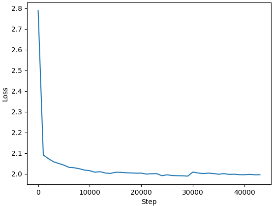

## Approach

The basic strategy was to train on smaller models with a local GPU while the code was being developed, and then move to larger cloud GPUs to train the larger models.

In an effort to be time, GPU memory, and cash efficient, data set and response sizes were reduced. Otherwise, training processes followed the paper as much as possible

## Results

### GPT2-small

#### Methods

- Responses longer than 1280 characters were discarded.
- A validation set of 1000 examples was used to prevent overfitting.
- The learning rate was increased due to a smaller model.
- 250 generated responses from the test set were evaluated against the chosen response using GPT-4o-mini to compute the win rate
- The generations were done at a temperature of 0.7, and gpt-4o-mini was run at a temperature of 0.

| Stage | Optimizer |  LR  | Steps | n_batch | Train Set Size |
|-------|-----------|------|-------|---------|----------------|
| SFT   | AdamW     | 5e-5 | 43K   | 8       | 116K           |
| DPO   | RMSProp   | 1e-5 | 2400  | 64      | 115K           |

#### Results

| Model                | Win Rate   |
|----------------------|----------- |
| GPT2-small           |  9.2%      |
| GPT2-sm fine tuned   |  29.6%     |
| GPT2-sm DPO          |  41.2%     |

Here is the loss on the validation set for fine tuning:

Here are the loss, chosen vs reject win rate and avg log probability improvement for DPO:

### GPT2-medium

#### Methods

- Same as above, with a slightly lower learning rate since model is bigger

| Stage | Optimizer |  LR  | Steps | n_batch | Train Set Size |
|-------|-----------|------|-------|---------|----------------|
| SFT   | AdamW     | 3e-5 | 43K   | 8       | 116K           |
| DPO   | RMSProp   | 3e-6 | 2400  | 64      | 115K           |

#### Results

| Model                | Win Rate |
|----------------------|--------- |
| GPT2-med             |  15.6%   |
| GPT2-med fine tuned  |  36.4%   |
| GPT2-med DPO         |  58.0%   |

Here is the loss on the validation set for fine tuning:

Here are the loss, chosen vs reject win rate and avg log probability improvement for DPO:

### GPT2-large

#### Methods

- Due to GPU memory issues with this size of model, training examples over 384 tokens were rejected. This seems to have caused a shift in the log probabilities.
- The batch size and learning rate for pretraining were also increased to more closely match the GPT2 paper.

| Stage | Optimizer |  LR    | Steps | n_batch | Train Set Size |
|-------|-----------|--------|-------|---------|----------------|
| SFT   | AdamW     | 2e-5   | 5.4K  | 64      | 115K           |
| DPO   | RMSProp   | 1.5e-6 | 2400  | 64      | 114K           |

#### Results

| Model                | Win Rate |
|----------------------|--------- |
| GPT2-lg 0.7B 0-shot  |  17.7%   |
| GPT2-lg fine tuned   |  36.0%   |
| GPT2-lg DPO          |  63.2%   |

Here is the loss for the fine tuning:

Here are the loss, chosen vs reject win rate (i.e. $\pi_W > \pi_L$) and avg log probability improvement for DPO:

The supervised fine tuning results are not following the trend of the prior models.  [Work by OpenAI on scaling laws](https://arxiv.org/pdf/2001.08361) suggests cross entropy loss falls as a function of model parameters N via $kN^{-0.076}$. The medium model meets this prediction, but not the large.

| Model | Relative size | Observed | Predicted |
|-------|---------------|----------|-----------|
| Small | 117/117 = 1.0 |    2.16  |     n/a   |
| Med   | 345/117 = 2.9 |    1.99  |     1.99  |
| Large | 762/117 = 6.5 |    1.95  |     1.873 |

Hyperparameter tuning was attempted, including adding weight decay. None of this made any difference. Taking a look at [Figure 4 of the scaling laws paper](https://arxiv.org/pdf/2001.08361), it can be seen that for data sets of less than $10^9$ tokens, there is practically no cross entropy difference between the medium and large models. This fine tuning dataset is roughly $10^7$ tokens, so it seems possible that additional data would be required to meet the prediction.

### Results Comparison

- The DPO paper's methods were more thorough:
    - There was no mention of limiting the length of the data
    - They evaluated the models on the entire test set with the larger GPT-4 model
    - The calculated error bars on their metrics of $\pm 2\%$
- They used a 2.8B parameter model
- Thus, it is likely that this task is both more difficult and there is less variance on the performance estimate

| Model                  | Win Rate |
|------------------------|--------- |
| Pythia 2.8B 2-shot     |  23%     |
| Pythia 2.8B fine tuned |  40%     |
| Pythia 2.8B DPO        |  64%     |

- Given these results, we can plot model size versus performance:

As discussed, it is believed that the DPO performance exceeds the paper because the test set is smaller (higher variance) and easier (shorter examples), while the SFT plateu is caused by the smaller training set and insufficient regularization.

Nevertheless, the efficacy of DPO has been replicated!

### Analysis of Variance

- 100 samples were run 8 times through the model and then evaluated via GPT-4o-mini to get a sense of the variance. The results with error bars are shown below

|  Model   | Stage |  Date  | Win Rate |   STD    |   Min    |   Max    |
|----------|-------|--------|----------|----------|----------|----------|
| gpt2-sm  | SFT   | Aug 09 |  29.9%   |   2.0%   |  28.0%   |  33.0%   |
| gpt2-sm  | DPO   | Aug 09 |  34.3%   |   4.6%   |  29.0%   |  44.0%   |
| gpt2-med | SFT   | Aug 09 |  36.4%   |   1.7%   |  33.0%   |  39.0%   |
| gpt2-med | DPO   | Aug 11 |  53.0%   |   2.9%   |  49.0%   |  57.0%   |
| gpt2-lg  | SFT   | Aug 21 |  33.2%   |   2.7%   |  29.0%   |  38.0%   |
| gpt2-lg  | DPO   | Aug 21 |  58.4%   |   2.4%   |  55.0%   |  62.0%   |

